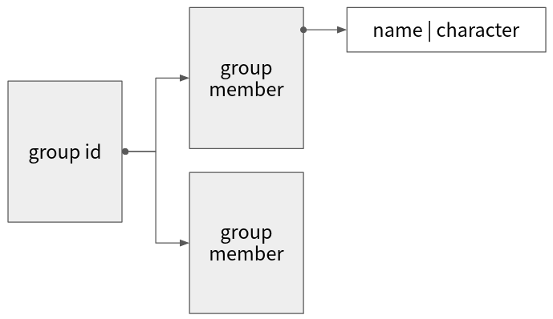

控制權限
===

目前我想到的控制權限主要有兩個維度，第一個是群組管理者/群組內用戶/一般人三種權限，第二個則是不同群組（以國樂社來說就是不同聲部，不同聲部可能會有屬於他們自己的樂器，只能借給聲部內的成員）

因此接口對用戶身份的權限也有要求，像是管理接口就必須是該部門的管理者，而租借器材的接口就必須由群組會員才能夠提出（這部份依據管理員對接口的管理設定可能會有所不同）

## 數據結構

考慮到一個用戶可能有多個角色（至少按照我的經驗出現過像是同時是 A 聲部的組長，B 聲部的組員）要怎麼設計（一個）「用戶」與（多個）「角色」是一個問題

```
我目前是用 Role-based Access Control （RBAC）去思考
```

首先「管理者/會員/一般人」的這個維度區分可以假設不會變動，那麼要怎麼讓新增群組的操作負擔減小的數據結構就是我們的目標了

於是我們又給出另外一個假設：「這種兩棲/三棲或以上的人很少」，也就是代表這個數據結構可能會接近一個稀疏矩陣，假設我們 table 只紀錄「管理者/會員」的資料而不紀錄一般人（也就是以這個名字去查結果不存在的話他在那個群組裡的權限就是一般人）



上圖灰色格子代表 database table，白色格子則是裡面的欄位

不過如果採用上述的數據結構，則對於操作需要權限的設置語意會被限縮到「什麼群組/什麼角色可以操作」，但支援複數個群組的 or 語意（像是只要是 A 或 B 群組內的會員都可以租借）支援程度不佳（感覺畢竟放在不同的子表裡效率比較差？）

```
目前權限劃分偏向扁平管理，也就是說並沒有上下級關係（除了 root 管理權限外）
```
