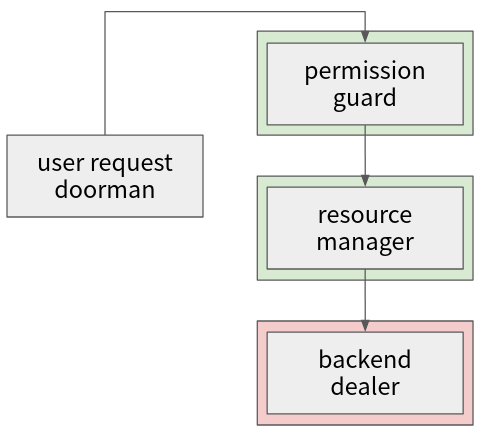

模組架構
===



上圖是目前簡略的架構圖，綠底模組代表唯讀，紅底代表涉及到寫入，理論上可以有多個 RLock 但是只有一個 WLock 所以可能可以在這塊做點優化

```
好像還需要設計一個錯誤碼，
```

### Request Doorman
顧名思義就是一開始通過 Https request 收到用戶請求後處理的第一塊模組，這邊除了把數據格式包好傳給後面模組的主要工作外，可能需要涵蓋其他功能性的優化，包含去除一些不合格式的請求；又或者先做一個簡單的限速器，防止資料庫負載過大

### Permission Guard
針對部份需要特定權限的操作，透過 Guard 守衛這個模組去讀後端數據庫，檢查該用戶（與可能的操作對象）是否符合權限要求；另外如果之後 Redis 快取加入之後，也可以把部份權限塞到 Redis 裡

### Resource Keeper
Keeper 是相對比較「軟性」的守衛，相較於權限比較死的規範，這邊限制的像是用戶在一定時內最多能發出的資源使用請求，又或是像是像是限制排隊長度以節約服務器存儲開銷

總體而言，Keeper 負責讓服務器硬體資源或是應用定義的軟資源不被耗光

### Backend Dealer
通過前面重重的管控就是為了排除無意義的的寫請求，這是因為寫請求在我們非分佈式的資料庫是一個 blocking 操作，是系統的效能瓶頸

到了最後 Dealer 這步驟，就真的要改變資料庫的資料狀態了